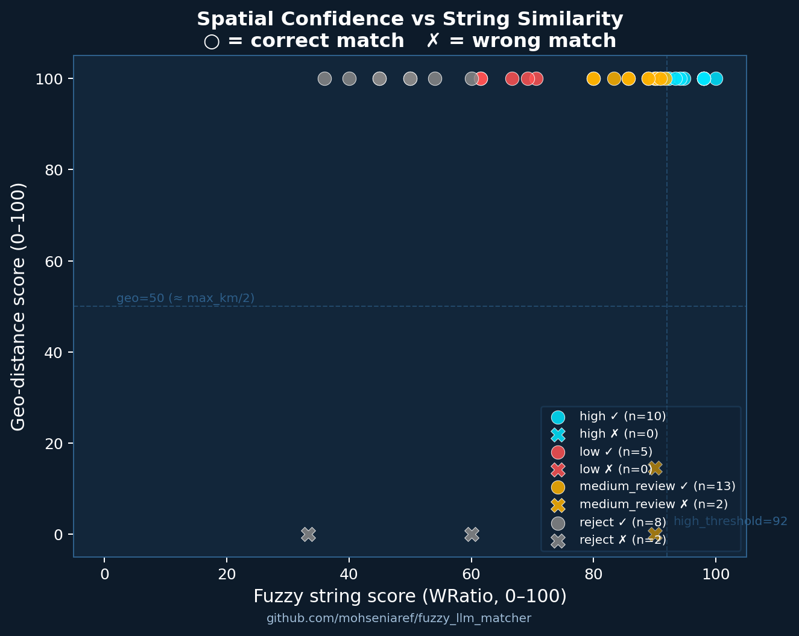
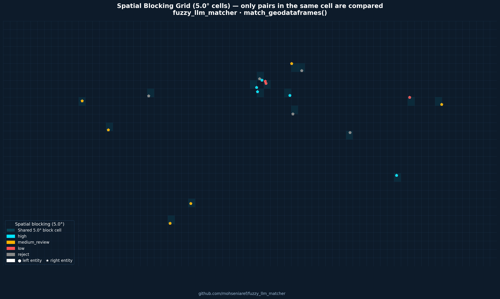
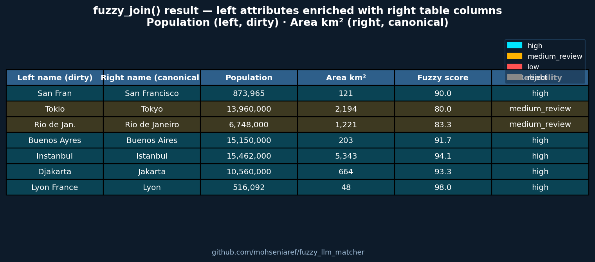
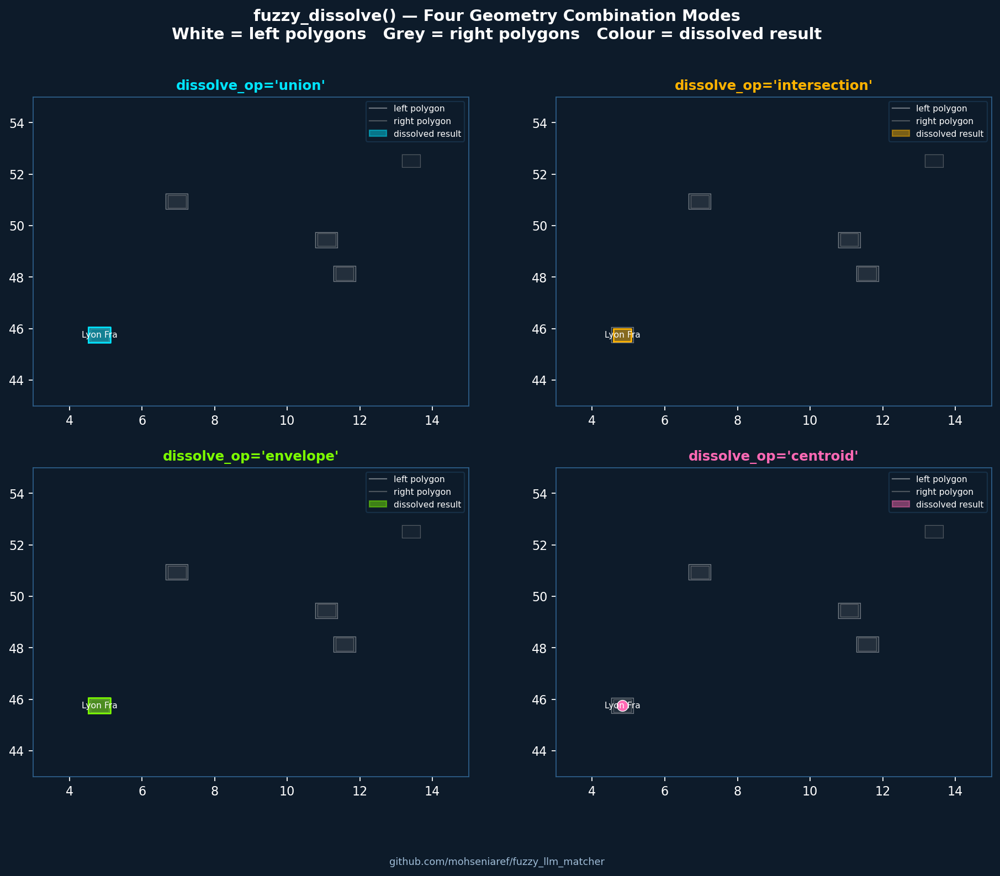
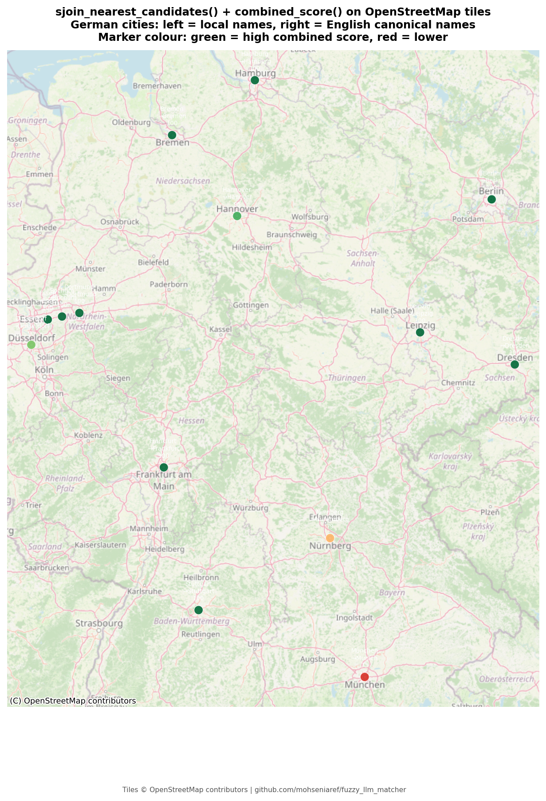
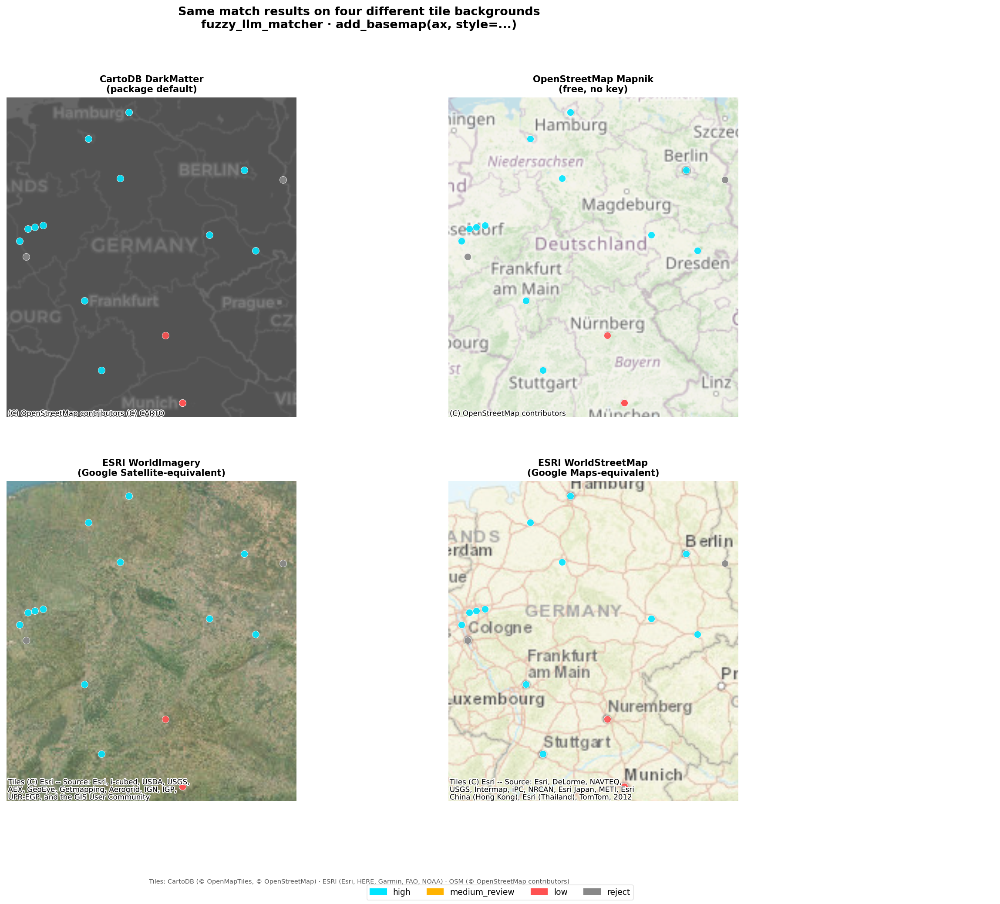
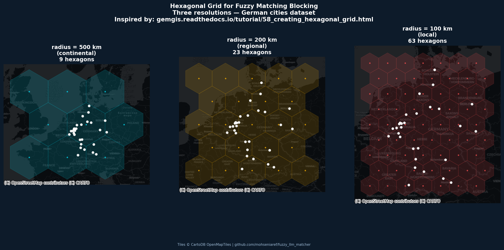
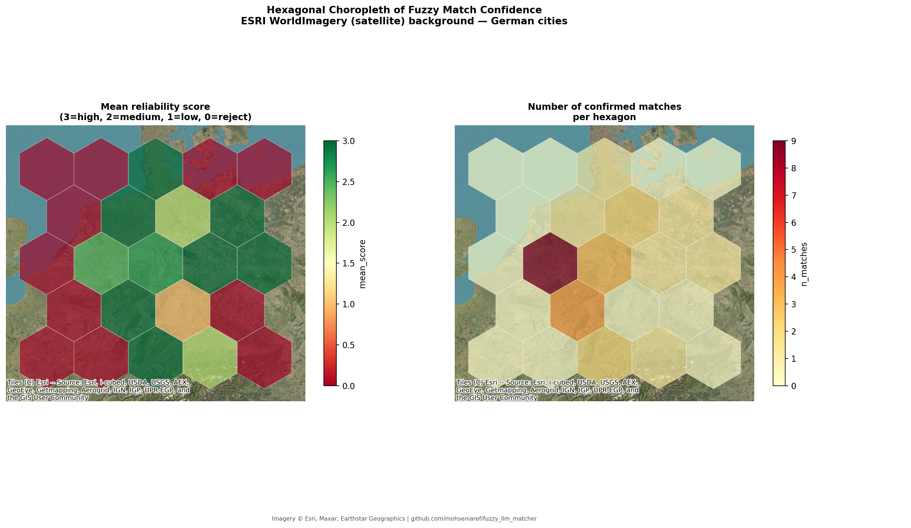

# fuzzy_llm_matcher

[](https://doi.org/10.5281/zenodo.21803695)

> ⚠️ **Experimental / alpha (v0.2.0-alpha).** APIs may change without notice
> and this has not yet been independently validated on production data.
> Use at your own risk — bug reports and feedback via
> [GitHub Issues](https://github.com/mohseniaref/fuzzy_llm_matcher/issues) welcome.


Reliable fuzzy matching for noisy tabular data and **geospatial data**, combining
deterministic string similarity, score-margin based confidence estimation, optional
LLM review for ambiguous cases, and — new in this release — **spatial proximity as a
confidence signal** for geographic entity resolution.

The key contribution isn't just fuzzy matching — it's the **reliability layer** that
flags which matches are trustworthy and which are uncertain or falsely confident, so you
know where to look before trusting a merge. For geodata, a second signal is added: two
features with similar names but 5,000 km apart are almost certainly not the same entity.

---

## Table of Contents

1. [Install](#install)
2. [Quickstart — plain tables](#quickstart--plain-tables)
3. [Quickstart — GeoDataFrames](#quickstart--geodataframes)
4. [How it works](#how-it-works)
5. [Geo extensions](#geo-extensions)
   - [score\_geo\_distance](#score_geo_distance)
   - [match\_geodataframes()](#match_geodataframes)
   - [fuzzy\_join() and fuzzy\_join\_geodataframes()](#fuzzy_join-and-fuzzy_join_geodataframes)
   - [fuzzy\_dissolve()](#fuzzy_dissolve)
   - [Geo-aware LLM prompt](#geo-aware-llm-prompt)
6. [Using a real LLM client](#using-a-real-llm-client)
7. [Benchmarks](#benchmarks)
8. [Simulating dirty data](#simulating-dirty-data)
9. [Scaling](#scaling)
10. [Tests](#tests)
11. [Repository structure](#repository-structure)
12. [Future extensions](#future-extensions)
13. [Citation](#citation)
14. [License](#license)

---

## Install

```bash
pip install -e .

# With development / test tools:
pip install -e ".[dev]"

# With geo support (GeoDataFrames, dissolve, maps):
pip install -e ".[geo]"

# Everything:
pip install -e ".[dev,benchmarks,geo]"
```

**Core dependencies:** `pandas`, `rapidfuzz`.
If `rapidfuzz` is not installed the package falls back to a pure-Python `difflib`
scorer (slower, slightly less accurate) — useful for quick offline demos.

**Geo dependencies** (`[geo]` extra): `geopandas`, `shapely`, `matplotlib`, `geodatasets`.

---

## Quickstart — plain tables

```python
import pandas as pd
from fuzzy_llm_matcher import match_tables

left  = pd.read_csv("data/sample_dirty_left.csv")
right = pd.read_csv("data/sample_dirty_right.csv")

matches = match_tables(
    left_df=left,
    right_df=right,
    left_on="name",
    right_on="name",
    left_id="id",
    right_id="id",
    top_k=5,
    use_llm=False,
)
print(matches)
```

Output columns:

| Column | Description |
|--------|-------------|
| `left_id`, `right_id` | Record identifiers from each table |
| `left_value`, `right_value` | The matched text values |
| `fuzzy_score` | Best string similarity score (0–100, WRatio) |
| `score_margin_to_second_best` | Gap between best and second-best candidate |
| `reliability_label` | `high` / `medium_review` / `low` / `reject` |
| `llm_same_entity` | LLM verdict (True/False/None) |
| `llm_confidence` | LLM confidence (`low`/`medium`/`high`) |
| `final_decision` | True = accepted match |

---

## Quickstart — GeoDataFrames

```python
import geopandas as gpd
from fuzzy_llm_matcher import match_geodataframes

# Any GeoDataFrame with Point, Polygon, or MultiPolygon geometry in EPSG:4326
result = match_geodataframes(
    left_gdf, right_gdf,
    left_on="name", right_on="name",
    left_id="id",  right_id="id",
    spatial_block_degrees=5.0,   # restrict comparisons to ~500 km grid cells
    max_distance_km=500.0,       # distance at which geo score reaches 0
    use_llm=True,                # geo context injected into prompt automatically
    return_geometry=True,        # result is a GeoDataFrame ready for .plot()
)

# Export confirmed matches as GeoJSON
result[result["final_decision"]].to_file("matches.geojson", driver="GeoJSON")
result.plot(column="reliability_label", legend=True)
```

Additional columns in the geo result:

| Column | Description |
|--------|-------------|
| `score_geo_distance` | Proximity score (100 = same location, 0 = ≥ `max_distance_km`) |
| `left_lat`, `left_lon` | Centroid of the left feature |
| `right_lat`, `right_lon` | Centroid of the right feature |
| `geometry` | Left-side geometry (attached when `return_geometry=True`) |

---

## How it works

### Pipeline (plain tables)

```
left_df ──┐
          ├── generate_candidates()     top-k fuzzy candidates per row, optional blocking
right_df ─┘        │
                   ▼
           compute_similarity_features()   WRatio, token_sort, token_set, partial, simple,
                   │                       length_diff, score_margin_to_second_best
                   ▼
           assign_reliability()            high / medium_review / low / reject
                   │
          ┌────────┴────────┐
          │  use_llm=True   │  use_llm=False
          ▼                 │
 review_uncertain_pairs()   │   (skip LLM, medium_review pairs stay unconfirmed)
 (medium_review only)       │
          │                 │
          └────────┬────────┘
                   ▼
           final_decision = True when:
             • reliability_label == "high", OR
             • reliability_label == "medium_review" AND llm_same_entity == True
```

### Confidence labels

| Label | Meaning | Action |
|-------|---------|--------|
| `high` | Strong score + clear margin over runner-up | Accept automatically |
| `medium_review` | Good score but ambiguous / close runner-up | Send to LLM or human review |
| `low` | Weak score, probably wrong | Flag for inspection |
| `reject` | Below minimum threshold | Discard |

The **score margin** (`score_margin_to_second_best`) is the key differentiator from
simple fuzzy matchers: a score of 95 means nothing if there are two candidates scoring
95 and 94 — the pick is genuinely ambiguous. The margin catches this case.

---

## Geo extensions

### score\_geo\_distance

Converts the haversine distance between two points into a 0–100 similarity score:
100 = same location, 0 = ≥ `max_km` apart (linear interpolation).

```python
from fuzzy_llm_matcher import add_geo_distance_score, haversine_km

# Add to any candidates DataFrame that already has lat/lon columns
candidates["left_lat"]  = ...
candidates["right_lat"] = ...
scored = add_geo_distance_score(candidates, max_km=500.0)
# → adds "score_geo_distance" column

# Direct distance calculation
dist = haversine_km(lat1=48.14, lon1=11.58, lat2=48.14, lon2=11.58)  # → 0.0 km
```

Use `score_geo_distance` as the primary matching signal for purely spatial problems,
or as a tie-breaker alongside `fuzzy_score` for name+location matching.

---

### match\_geodataframes()

Full spatial matching pipeline in one call:

```python
from fuzzy_llm_matcher import match_geodataframes

result = match_geodataframes(
    left_gdf, right_gdf,
    left_on="name", right_on="name",
    left_id="id",  right_id="id",

    # Spatial blocking: only compare pairs within the same ~500 km grid cell
    spatial_block_degrees=5.0,

    # Geo-distance score: 0 at 500 km, 100 at same location
    max_distance_km=500.0,

    # Standard matching parameters
    top_k=5,
    scorer="WRatio",
    high_threshold=92,
    medium_threshold=80,
    reject_threshold=60,

    # LLM review for uncertain pairs (coordinates auto-included in prompt)
    use_llm=True,

    # Parallelism
    n_jobs=-1,

    # Return a GeoDataFrame with left geometry attached
    return_geometry=True,
)
```

**What it does internally:**
1. Extracts centroids from any geometry type (Point, Polygon, MultiPolygon)
2. Snaps centroids to a degree-grid → automatic spatial block key
3. Runs fuzzy candidate generation restricted to same-cell pairs
4. Computes string similarity features
5. Joins centroid coordinates onto candidate pairs
6. Computes `score_geo_distance` via haversine
7. Assigns reliability labels
8. Optionally sends uncertain pairs to LLM with coordinate context
9. Computes `final_decision`
10. Attaches left geometry and returns a `GeoDataFrame`

---

### fuzzy\_join() and fuzzy\_join\_geodataframes()

Fuzzy equivalents of `pd.merge()` and `gpd.sjoin()` — same calling convention,
same `how` parameter, brings all columns from both tables into a single result.

```python
from fuzzy_llm_matcher import fuzzy_join, fuzzy_join_geodataframes

# ── Plain DataFrames ──────────────────────────────────────────────────────
# Exact join (pandas)
result = pd.merge(left, right, left_on="city", right_on="name")

# Fuzzy join (this package) — identical output shape
result = fuzzy_join(
    left, right,
    left_on="city", right_on="name",
    left_id="id",   right_id="id",
    how="inner",          # "inner" | "left" | "all"
    suffixes=("", "_ref"),
    use_llm=True,
)
# → all columns from both tables + _fuzzy_score + _reliability

# ── GeoDataFrames ─────────────────────────────────────────────────────────
# Exact spatial join (geopandas)
result = gpd.sjoin(left, right, how="inner", predicate="intersects")

# Fuzzy name join with spatial confidence (this package)
result = fuzzy_join_geodataframes(
    left_gdf, right_gdf,
    left_on="NAME_1", right_on="name",
    how="left",
    spatial_block_degrees=3.0,
    max_distance_km=200.0,
    geometry="left",      # "left" | "right" | "both"
)
# → GeoDataFrame, all attributes from both sides + _fuzzy_score + _geo_score + _reliability
```

**`how` options:**

| Value | Behaviour |
|-------|-----------|
| `"inner"` | Only rows with `final_decision=True` (default) |
| `"left"` | All left rows; unmatched get `NaN` in right-side columns |
| `"all"` | All candidate pairs including `low` and `reject` |

---

### fuzzy\_dissolve()

Match two GeoDataFrames and **merge the geometries** of confirmed pairs — the fuzzy
equivalent of `geopandas.GeoDataFrame.dissolve()`.

```python
from fuzzy_llm_matcher import fuzzy_dissolve

# Union: merge the two polygons into one larger polygon
dissolved = fuzzy_dissolve(
    gadm_polygons, osm_polygons,
    left_on="NAME_1", right_on="name",
    left_id="id",     right_id="id",
    dissolve_op="union",
    aggfunc={"population": "mean", "area_km2": "sum"},
)

dissolved.plot(column="_reliability", legend=True, figsize=(12, 8))
dissolved.to_file("dissolved_matches.geojson", driver="GeoJSON")
```

**`dissolve_op` options:**

| Mode | Result geometry | Typical use case |
|------|----------------|-----------------|
| `"union"` | Spatial union of left + right | Merge two admin boundary datasets that cover the same region |
| `"intersection"` | Overlapping area only | Quantify spatial agreement between datasets |
| `"envelope"` | Bounding box of both | Coarse spatial extent of the matched pair |
| `"centroid"` | Midpoint between centroids | Collapse point clouds, reconcile GPS positions |
| `"left"` | Left geometry unchanged | Enrich left features with right attributes only |
| `"right"` | Right geometry unchanged | Replace left geometry with authoritative right geometry |

Output columns include `_fuzzy_score`, `_geo_score`, `_reliability`, `_left_name`,
`_right_name`, `_dissolve_op`, plus any aggregated attribute columns.

---

### Geo-aware LLM prompt

When coordinate columns are present, `review_uncertain_pairs_with_llm` automatically
builds a richer prompt that includes the exact coordinates and haversine distance of
each uncertain pair:

```
Record A: München     coordinates: (48.1400°N, 11.5800°E)
Record B: Munich      coordinates: (48.1400°N, 11.5800°E)
Distance: 0.0 km
```

This allows the LLM to combine name similarity **and** spatial proximity when
adjudicating ambiguous pairs — especially useful for transliterations (Köln/Cologne,
Moskva/Moscow) where string similarity alone is low but the locations are identical.

You can also call `build_prompt()` directly:

```python
from fuzzy_llm_matcher import build_prompt

# Standard prompt (no geo context)
prompt = build_prompt("München", "Munich")

# Geo-enriched prompt
prompt = build_prompt(
    "München", "Munich",
    geo_context="Record A: (48.14°N, 11.58°E)  Record B: (48.14°N, 11.58°E)  Distance: 0.0 km"
)
```

To use a real LLM with geo context, implement the `geo_context` kwarg in your client:

```python
class MyGeoLLMClient:
    def review(self, left_value, right_value, geo_context=None):
        prompt = build_prompt(left_value, right_value, geo_context=geo_context)
        # ... call your LLM API ...
        return {"same_entity": True, "confidence": "high", "reason": "..."}
```

---

## Using a real LLM client

`review_uncertain_pairs_with_llm` accepts any object with a
`.review(left_value, right_value) -> dict` method. Example wrapping the
Anthropic API:

```python
import json
from anthropic import Anthropic
from fuzzy_llm_matcher import build_prompt

class AnthropicClient:
    def __init__(self, model="claude-sonnet-5"):
        self.client = Anthropic()
        self.model  = model

    def review(self, left_value, right_value, geo_context=None):
        prompt = build_prompt(left_value, right_value, geo_context=geo_context)
        resp = self.client.messages.create(
            model=self.model,
            max_tokens=200,
            messages=[{"role": "user", "content": prompt}],
        )
        return json.loads(resp.content[0].text)

matches = match_tables(
    left, right,
    left_on="name", right_on="name",
    left_id="id", right_id="id",
    use_llm=True,
    llm_client=AnthropicClient(),
)
```

---

## Benchmarks

```bash
python benchmarks/company_name_test.py          # bundled sample + simulated data
python benchmarks/llm_review_test.py            # RapidFuzz-only vs +reliability vs +LLM
python benchmarks/febrl_test.py                 # requires: pip install recordlinkage
python benchmarks/abt_buy_paper_dataset_test.py # published Abt-Buy dataset (SIGMOD'18)
python benchmarks/splink_baseline.py            # requires: pip install splink
```

Metrics reported: precision, recall, F1, false positives/negatives,
**false confident matches** (pairs labeled `high` that are actually wrong —
the critical trust metric), number of pairs sent to the LLM, estimated LLM cost
per 1,000 rows, and runtime.

---

## Simulating dirty data

```python
from fuzzy_llm_matcher import simulate_dirty_entities

df = simulate_dirty_entities(
    ["TU Delft", "SkyGeo Netherlands", "Statista Strategy GmbH"],
    n_variants=3,
    random_state=42,
)
```

Generates noisy variants via: abbreviation, dropped words, word-order swaps,
punctuation changes, legal-suffix changes, spelling noise, capitalisation changes,
extra location tokens, partial names, and initialised first words.

---

## Scaling

```bash
# Parallel CPU scoring (rapidfuzz releases the GIL — real speedup):
matches = match_tables(..., n_jobs=-1)

# SQL / DuckDB / PySpark patterns:
python examples/pyspark_sql_fuzzy_matching.py

# OSM / GeoNames place-name benchmark (offline, 40 hard pairs):
python examples/osm_geonames_place_matching.py

# Geo-distance confidence features demo:
python examples/geo_spatial_confidence.py

# GeoDataFrame matching with spatial blocking:
python examples/geo_match_geodataframes.py

# Fuzzy join and dissolve:
python examples/geo_fuzzy_join_dissolve.py

# World-map visualisation:
python examples/geo_map_visualization.py

# Spatial proximity matching (sjoin_nearest) + tile basemaps:
python examples/geo_sjoin_basemap.py

# Hexagonal grid blocking + choropleth:
python examples/geo_hexagon_matching.py
```

---

## Hexagonal grid blocking

The optimal tessellation for spatial blocking — equal-area cells, 6 equidistant
neighbours, no polar distortion.

```python
from fuzzy_llm_matcher import (
    create_hexagon, create_hexagon_grid, assign_hex_ids, hex_block_match,
    add_basemap,
)

# Build a hex grid over any GeoDataFrame
grid = create_hexagon_grid(gdf, radius_m=10_000, projected_crs="EPSG:32633")

# Assign each feature to its hexagon cell
gdf_hexed = assign_hex_ids(gdf, grid)

# Full pipeline: hex blocking → fuzzy matching → geo score → LLM review
result, grid = hex_block_match(
    left_gdf, right_gdf,
    left_on="name", right_on="name",
    hex_radius_m=10_000,           # 10 km cells
    projected_crs="EPSG:32633",    # UTM zone for accurate distances
    use_llm=True,
    return_grid=True,
)

# Choropleth of match confidence per hexagon on satellite background
ax = grid.to_crs(3857).plot(column="hex_id", legend=True, alpha=0.6)
add_basemap(ax, style="satellite")
```

**Why hexagonal > degree-grid blocking:**
- Equal area per cell (no polar distortion)
- 6 equidistant neighbours (vs 4 for square grids — fewer edge artefacts)
- Shortest perimeter per unit area → fewer boundary misses
- `radius_m` in metres, not degrees — scale-independent

*Inspired by: [gemgis.readthedocs.io/tutorial/58_creating_hexagonal_grid.html](https://gemgis.readthedocs.io/en/latest/getting_started/tutorial/58_creating_hexagonal_grid.html)*

---

## Tests

```bash
pip install -e ".[dev]"
pytest              # 19 tests, < 1 s
```

---

## Repository structure

```text
fuzzy_llm_matcher/        core package
  api.py                  match_tables(), match_geodataframes(),
                          fuzzy_join(), fuzzy_join_geodataframes(),
                          fuzzy_dissolve()
  candidate_generation.py top-k fuzzy candidate generation
  fuzzy_scores.py         string + geo-distance similarity features
  geo_proximity.py        sjoin_nearest, combined_score, hex grid,
                          TileBasemap / add_basemap
  llm_review.py           LLM review, geo-aware prompt, MockLLMClient
  reliability.py          confidence labelling
  simulation.py           dirty-data generator
  utils.py                normalisation, scorers, difflib fallback

docs/
  STEP_BY_STEP_GUIDE.md   package walkthrough for new users
  GEO_GUIDE.md            complete geo-matching reference

benchmarks/               precision/recall/F1 benchmark scripts
examples/                 runnable demos (geo, SQL, PySpark, maps)
data/                     bundled sample CSVs + ground truth
tests/                    pytest test suite (19 tests)
notebooks/
  figures/                publication-quality output figures
```

---

## Figures gallery

| Figure | Description |
|--------|-------------|
|  | OSM/GeoNames 40-city benchmark — arcs coloured by reliability |
|  | Fuzzy score vs geo-distance score, coloured by reliability label |
|  | Spatial blocking grid — pairs in the same cell are compared |
|  | `fuzzy_join()` result — dirty names joined to canonical names |
|  | `fuzzy_dissolve()` — four geometry combination modes |
|  | `sjoin_nearest_candidates()` + `combined_score()` on OSM tiles |
|  | Same data on 4 tile styles (dark/OSM/satellite/Google-like) |
|  | Hexagonal grid at three resolutions on CartoDB Dark tiles |
|  | Hex choropleth of match confidence on ESRI satellite imagery |

---

## Future extensions

- Temporal blocking for historical name changes (Leningrad → Saint Petersburg)
- H3 hexagonal index integration (Uber H3) for multi-resolution hex IDs
- QGIS Processing algorithm plugin
- CLI (`fuzzy-geo-match left.csv right.csv --output matches.csv`)
- Embedding-based multilingual name matching (sentence-transformers)
- Active-learning threshold calibration loop

---

## Citation

See `CITATION.cff`. DOI: [10.5281/zenodo.21803695](https://doi.org/10.5281/zenodo.21803695)

## License

MIT — see `LICENSE`.

