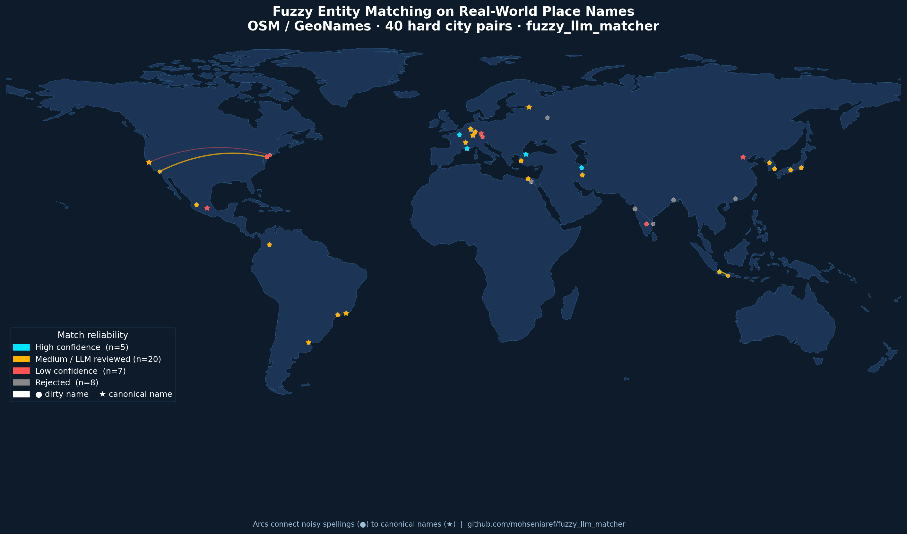

# fuzzy_llm_matcher

[](https://doi.org/10.5281/zenodo.21803695)

> ⚠️ **Experimental / alpha (v0.1.0-alpha).** APIs may change without notice
> and this has not yet been independently validated on production data.
> Use at your own risk — bug reports and feedback via
> [GitHub Issues](https://github.com/mohseniaref/fuzzy_llm_matcher/issues) welcome.



Reliable fuzzy matching for noisy tabular data, combining deterministic
string similarity, score-margin based confidence estimation, and optional
LLM review for ambiguous cases.

The key contribution isn't just fuzzy matching — it's the **reliability
layer** that flags which matches are trustworthy and which are uncertain
or falsely confident, so you know where to look before trusting a merge.

## Install


```bash
pip install -e .
# or, with dev/benchmark extras:
pip install -e ".[dev,benchmarks]"
```

Core dependencies: `pandas`, `rapidfuzz`. If `rapidfuzz` isn't installed,
the package automatically falls back to a pure-Python `difflib`-based
scorer (slower, slightly less accurate, zero extra dependencies) — useful
for quick offline demos, but install `rapidfuzz` for real use.

## Start here (step-by-step)

If you want a very practical walkthrough, read:

- `docs/STEP_BY_STEP_GUIDE.md`

It explains the package in simple stages: dataset shape, matching pipeline,
confidence labels, optional LLM review, evaluation, and tuning.

## Quickstart

```python
import pandas as pd
from fuzzy_llm_matcher import match_tables

left = pd.read_csv("data/sample_dirty_left.csv")
right = pd.read_csv("data/sample_dirty_right.csv")

matches = match_tables(
    left_df=left,
    right_df=right,
    left_on="name",
    right_on="name",
    left_id="id",
    right_id="id",
    top_k=5,
    use_llm=False,
)

print(matches)
```

Output columns: `left_id, right_id, left_value, right_value, fuzzy_score,
score_margin_to_second_best, reliability_label, llm_same_entity,
llm_confidence, final_decision`.

The bundled sample in `data/` is intentionally richer now: realistic
organization names, abbreviations, legal-suffix variations, acronym
collisions (for example ESA vs ESADE, WHO vs WHO Foundation), and hard
distractors.

## How it works

1. **Candidate generation** (`generate_candidates`) — fuzzy top-k candidates
   per row, with optional exact blocking on a column to cut down
   comparisons on large datasets.
2. **Multi-metric scoring** (`compute_similarity_features`) — WRatio,
   token-sort, token-set, partial, and simple-ratio scores, plus the score
   margin between the best and second-best candidate.
3. **Reliability labeling** (`assign_reliability`) — buckets each pair into
   `high` / `medium_review` / `low` / `reject` based on score and margin.
4. **Optional LLM review** (`review_uncertain_pairs_with_llm`) — only
   `medium_review` pairs get sent to an LLM, which returns strict JSON
   (`same_entity`, `confidence`, `reason`). Fully mockable — see
   `MockLLMClient` — so tests run without any API key.

The LLM never replaces deterministic matching; it only adjudicates
genuinely ambiguous cases.

## Using a real LLM client

`review_uncertain_pairs_with_llm` accepts any object with a
`.review(left_value, right_value) -> dict` method. Example wrapping the
Anthropic API:

```python
import json
from anthropic import Anthropic
from fuzzy_llm_matcher.llm_review import build_prompt

class AnthropicClient:
    def __init__(self, model="claude-sonnet-5"):
        self.client = Anthropic()
        self.model = model

    def review(self, left_value, right_value):
        resp = self.client.messages.create(
            model=self.model,
            max_tokens=200,
            messages=[{"role": "user", "content": build_prompt(left_value, right_value)}],
        )
        return json.loads(resp.content[0].text)

matches = match_tables(left, right, left_on="name", right_on="name",
                        left_id="id", right_id="id",
                        use_llm=True, llm_client=AnthropicClient())
```

## Benchmarks

```bash
python benchmarks/company_name_test.py   # bundled sample + simulated data
python benchmarks/llm_review_test.py     # RapidFuzz-only vs +reliability vs +LLM
python benchmarks/febrl_test.py          # requires: pip install recordlinkage
python benchmarks/abt_buy_paper_dataset_test.py  # published Abt-Buy dataset (SIGMOD'18 benchmark set)
python benchmarks/splink_baseline.py     # requires: pip install splink
```

Metrics reported: precision, recall, F1, false positives/negatives,
**false confident matches** (pairs labeled `high` that are actually
wrong — the most important number for trusting automated merges),
number of pairs sent to the LLM, estimated LLM cost per 1,000 rows, and
runtime.

## Simulating dirty data

```python
from fuzzy_llm_matcher import simulate_dirty_entities

df = simulate_dirty_entities(
    ["TU Delft", "SkyGeo Netherlands", "Statista Strategy GmbH"],
    n_variants=3,
    random_state=42,
)
```

Generates noisy variants via abbreviation, dropped words, word-order
swaps, punctuation changes, legal-suffix changes, spelling noise,
capitalization changes, extra location tokens, partial names, and
initialized first names/words.

## Scaling and other data sources

```bash
python examples/pyspark_sql_fuzzy_matching.py     # n_jobs parallelism, DuckDB SQL, SQLite SQL patterns
python examples/osm_geonames_place_matching.py    # 40 hard OpenStreetMap/GeoNames city-name pairs
python examples/geo_map_visualization.py          # world-map figure of the geo matching results
```

- `match_tables(..., n_jobs=-1)` parallelizes candidate scoring across CPU cores
  (rapidfuzz releases the GIL, so threads give a real speedup).
- `examples/pyspark_sql_fuzzy_matching.py` shows the same matching logic expressed as
  DuckDB SQL and SQLite SQL, plus a documented PySpark broadcast + `mapPartitions` pattern
  for cluster-scale matching.
- `examples/osm_geonames_place_matching.py` is an offline benchmark of transliterations,
  abbreviations, and local-vs-English place names (Moskva/Moscow, NYC/New York City, etc.).
- `examples/geo_map_visualization.py` renders `notebooks/figures/geo_matching_world_map.png`,
  a dark-themed world map with arcs connecting each dirty name to its canonical match,
  colored by reliability — handy for sharing results.

## Tests

```bash
pip install -e ".[dev]"
pytest
```

## Repository structure

```text
fuzzy_llm_matcher/   core package
docs/                step-by-step package guide
benchmarks/          benchmark scripts (FEBRL, company names, LLM comparison, Splink, Abt-Buy)
examples/            parallel/SQL/PySpark patterns, OSM geo benchmark, world-map figure
data/                small bundled sample CSVs + ground truth
tests/                pytest test suite
notebooks/           example notebooks (see notebooks/README.md)
```

## Future extensions

- Embedding-based semantic similarity
- Multilingual matching
- Address-specific matching and company-name normalization
- Active-learning review interface / Streamlit dashboard for manual review
- Excel export with highlighted uncertain matches

## Citation

See `CITATION.cff`. A Zenodo DOI can be minted once the repository is
published on GitHub (Zenodo → GitHub integration).

## License

MIT — see `LICENSE`.
