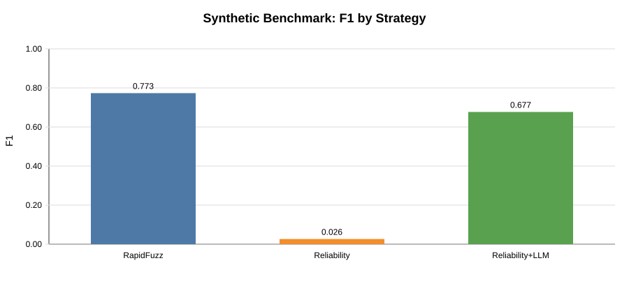
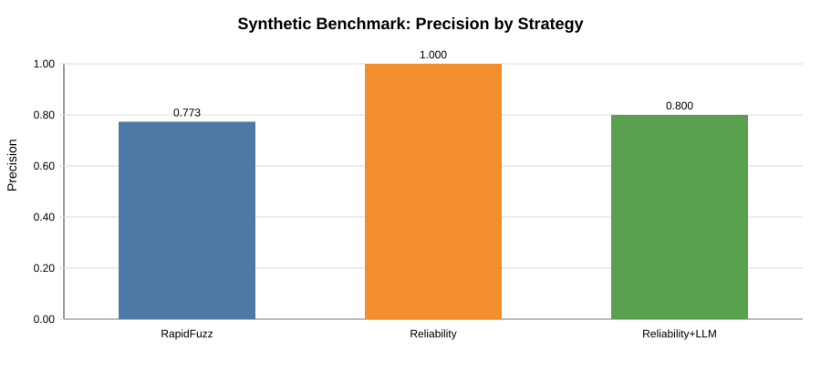
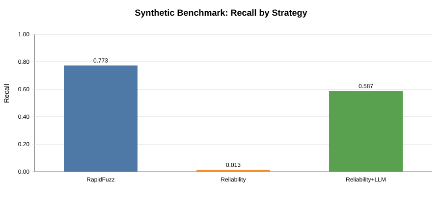

# Synthetic Validation Results

This report summarizes benchmark outputs generated from the project pipeline using synthetic noisy entity names and the bundled sample dataset.

## Synthetic benchmark setup

- Entities: `25`
- Variants per entity: `3`
- Seed: `7`
- Matching task: noisy left names vs clean right names

### Metrics by strategy

| Strategy | Precision | Recall | F1 | True Positives | False Positives | False Negatives | False Confident Matches | Pairs Sent to LLM |
|---|---:|---:|---:|---:|---:|---:|---:|---:|
| RapidFuzz only | 0.7733 | 0.7733 | 0.7733 | 58 | 17 | 17 | 0 | 0 |
| RapidFuzz + reliability | 1.0000 | 0.0133 | 0.0263 | 1 | 0 | 74 | 0 | 0 |
| RapidFuzz + reliability + LLM | 0.8000 | 0.5867 | 0.6769 | 44 | 11 | 31 | 0 | 70 |

## Figures

### F1 by strategy

### Precision by strategy

### Recall by strategy

## Bundled sample snapshot

From `data/sample_dirty_left.csv`, `data/sample_dirty_right.csv`, and `data/sample_ground_truth.csv` with `use_llm=True`:

- Precision: `1.0000`
- Recall: `0.4000`
- F1: `0.5714`
- False confident matches: `0`

Raw metric artifacts:

- `notebooks/synthetic_benchmark_metrics.csv`
- `notebooks/bundled_sample_metrics.json`
